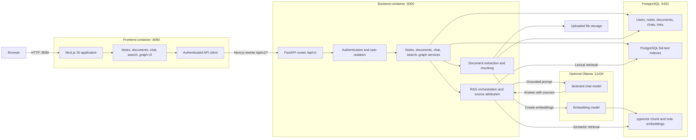

# Personal Knowledge Assistant

A self-hosted knowledge workspace for Markdown notes, document ingestion, relationship graphs, hybrid search, and local AI chat. The stack uses Next.js, FastAPI, PostgreSQL with pgvector, and optional Ollama models.

## Features

- Markdown notes with Obsidian-style live preview
- `[[Wiki links]]`, backlinks, and automatic graph relationships
- Full and local knowledge graph views
- Nested note folders and tags
- PDF, DOCX, Markdown, and text document ingestion
- Hybrid full-text and semantic search across documents, notes, and chats
- Conversational chat with grounded answers from documents and notes when relevant
- Authenticated, user-isolated workspaces
- Optional local model integration through Ollama

## Quick Start

### Requirements

- Docker Desktop or Docker Engine with Compose
- Git

### Run the stack

```bash
git clone https://github.com/itxkarthik/Personal-AI-Knowledge-Assistant.git
cd Personal-AI-Knowledge-Assistant
docker compose --profile ai up --build -d
```

Open:

- Application: [http://localhost:8080](http://localhost:8080)
- Swagger API documentation: [http://localhost:3000/docs](http://localhost:3000/docs)
- ReDoc API documentation: [http://localhost:3000/redoc](http://localhost:3000/redoc)
- Backend health: [http://localhost:3000/health/ready](http://localhost:3000/health/ready)

The frontend runs on port `8080`; FastAPI and its documentation run on port `3000`. Therefore, `http://localhost:8080/docs` returns `404` by design. Use `http://localhost:3000/docs`.

Check service health:

```bash
docker compose ps
```

Stop the stack:

```bash
docker compose down
```

Database data is stored in the `postgres_data` Docker volume and is preserved between restarts.

To run the core application without local AI, omit the profile:

```bash
docker compose up --build -d
```

## Configuration

Copy the example environment file and set secure local values before deployment:

```bash
cp backend/.env.example backend/.env
```

The main settings are:

| Variable | Purpose |
| --- | --- |
| `POSTGRES_USER` | PostgreSQL user |
| `POSTGRES_PASSWORD` | PostgreSQL password |
| `POSTGRES_DB` | Database name |
| `SECRET_KEY` | Token-signing secret |
| `FRONTEND_HOST` | Allowed frontend origin |
| `OLLAMA_BASE_URL` | Optional Ollama endpoint |

Ollama is optional for notes, document extraction, authentication, and graph features. The default stack stays lightweight and reports AI as unavailable without writing placeholder chat messages.

### Local AI

Start the stack with the optional Ollama profile:

```bash
docker compose --profile ai up --build -d
```

The profile starts Ollama and installs `llama3.2:1b` for chat plus `nomic-embed-text` for document and note embeddings. The first startup takes longer while those models download. Follow progress with:

```bash
docker compose logs -f ollama-models
```

Model data is retained in the `ollama_data` volume. Override `OLLAMA_CHAT_MODEL`, `OLLAMA_EMBEDDING_MODEL`, or `OLLAMA_BASE_URL` when using a different local runtime.

### Change models

Signed-in users can change their chat model from **Settings > Local AI model**:

1. Install the model in Ollama if it is not already available:

   ```bash
   docker compose exec ollama ollama pull qwen3:4b
   ```

2. Open **Settings > Local AI model** in the application.
3. Select **Refresh** to reload the installed model list.
4. Choose the model and select **Save model**.

The preference is saved per account and applies to new chat responses. `qwen3:4b` is the recommended local starting point; larger models generally improve multi-source synthesis but require more memory. The embedding model remains separate because changing its dimensions requires rebuilding the vector indexes.

`OLLAMA_CHAT_MODEL` and `OLLAMA_EMBEDDING_MODEL` set the Docker defaults for users who have no saved preference. Put overrides in `.env.docker`:

```bash
OLLAMA_CHAT_MODEL=qwen3:4b
OLLAMA_EMBEDDING_MODEL=nomic-embed-text
```

Start Compose with that environment file:

```bash
docker compose --env-file .env.docker --profile ai up --build -d
```

You can also assign a model from the command line. First install it in the shared Ollama volume:

```bash
docker compose exec ollama ollama pull qwen3:4b
```

Then save the per-user preference by email:

```bash
docker compose exec backend python -m scripts.set_user_model --email you@example.com --chat-model qwen3:4b
```

The account preference overrides the Docker default. Omit `--embedding-model` to keep `nomic-embed-text`; changing embedding dimensions requires rebuilding the vector indexes. Confirm the active Docker defaults and installed models with:

```bash
curl http://localhost:3000/health/ready
docker compose exec ollama ollama list
```

## Search and Chat

Search combines PostgreSQL full-text matching with pgvector semantic retrieval. The Documents, Notes, and Chats filters are applied independently, so a result does not need to repeat the exact query wording to match.

Chat uses three response paths:

- Casual conversation is answered directly without searching the workspace.
- General knowledge questions use the selected chat model when workspace context is unnecessary.
- Questions about personal notes, documents, or projects remain grounded in retrieved workspace context.

If the correct source appears but the answer is weak, use a stronger chat model. If the correct source does not appear, review the embedding model, chunking settings, and similarity threshold.

## Notes and Graphs

Notes are stored as Markdown. Link notes by title:

```markdown
This idea extends [[Distributed Systems]].
```

Saving the note creates a directed graph relationship. Renaming or deleting the wiki link updates that relationship. The graph also supports manually created `related`, `parent`, and `child` links.

## Development

Install dependencies from the repository root:

```bash
pnpm install
python -m pip install -r requirements.txt
```

Run the frontend:

```bash
pnpm --dir frontend dev
```

Run the backend in another terminal:

```bash
cd backend
python run.py
```

The local frontend expects PostgreSQL and the backend to be available. Docker Compose is the recommended development path when working across the full stack.

## Verification

```bash
docker compose build frontend backend
docker compose --profile ai up -d
docker compose --profile ai ps
curl http://localhost:3000/health/ready
```

## Architecture



The browser communicates only with the Next.js application. Browser API requests use the `/api/v1` rewrite to reach FastAPI inside the Docker network. FastAPI enforces account ownership before services access records, files, search indexes, or AI models. Search combines PostgreSQL full-text ranking with pgvector similarity; chat reuses the same indexed context when a question requires workspace grounding.

Key directories:

```text
frontend/app/          Next.js routes
frontend/components/   UI and feature components
frontend/lib/          API clients, hooks, and utilities
frontend/store/        Zustand stores
backend/app/api/       FastAPI routes
backend/app/services/  Application services
backend/app/models/    SQLModel database models
backend/app/schemas/   Request and response schemas
```

## Contributing

Keep pull requests focused, include verification steps, and document any environment or schema changes. Use clear commit messages that describe behavior rather than implementation detail.

Use [GitHub Issues](https://github.com/itxkarthik/Personal-AI-Knowledge-Assistant/issues) for bug reports, support questions, and feature requests.
