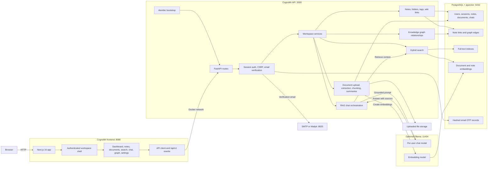

# Cognolith

Cognolith is a self-hosted knowledge workspace for connected notes, document ingestion, relationship graphs, hybrid search, and local AI chat. It runs on Next.js, FastAPI, PostgreSQL with pgvector, and optional Ollama models.

## Features

- Markdown notes with Obsidian-style live preview
- `[[Wiki links]]`, backlinks, and automatic graph relationships
- Full and local knowledge graph views
- Nested note folders and tags
- PDF, DOCX, Markdown, and text document ingestion
- Hybrid full-text and semantic search across documents, notes, and chats
- Conversational chat with grounded answers from documents and notes when relevant
- Authenticated, user-isolated workspaces
- Six-digit email verification with automatic sign-in
- Optional local model integration through Ollama

<!--## Screenshots

| Dashboard | Notes |
| --- | --- |
|  |  |
| Documents | Search |
|  |  |
| Chat | Knowledge Graph |
|  |  |-->

## Quick Start

### Requirements

- Docker Desktop or Docker Engine with Compose
- Git

### Run the stack

```bash
git clone https://github.com/itxkarthik/cognolith.git
cd cognolith
docker compose --profile ai up --build -d
```

Open:

- Application: [http://localhost:8080](http://localhost:8080)
- Swagger API documentation: [http://localhost:3000/docs](http://localhost:3000/docs)
- ReDoc API documentation: [http://localhost:3000/redoc](http://localhost:3000/redoc)
- Backend health: [http://localhost:3000/health/ready](http://localhost:3000/health/ready)
- Development email inbox: [http://localhost:8025](http://localhost:8025)

The frontend runs on port `8080`; FastAPI and its documentation run on port `3000`. Therefore, `http://localhost:8080/docs` returns `404` by design. Use `http://localhost:3000/docs`.

Check service health:

```bash
docker compose ps
```

Stop the stack:

```bash
docker compose down
```

Database data is stored in the `postgres_data` Docker volume and is preserved between restarts.

To run the core application without local AI, omit the profile:

```bash
docker compose up --build -d
```

## Configuration

For Docker, copy the root example and set local secrets:

```bash
cp .env.example .env
```

For backend-only development outside Docker, copy the backend example:

```bash
cp backend/.env.example backend/.env
```

Use `.env.docker.example` when you prefer an explicit Compose env file:

```bash
cp .env.docker.example .env.docker
docker compose --env-file .env.docker --profile ai up --build -d
```

The main settings are:

| Variable | Purpose |
| --- | --- |
| `POSTGRES_USER` | PostgreSQL user |
| `POSTGRES_PASSWORD` | PostgreSQL password |
| `POSTGRES_DB` | Database name |
| `SECRET_KEY` | Token-signing secret |
| `FRONTEND_HOST` | Allowed frontend origin |
| `SMTP_HOST` | SMTP server used for verification emails |
| `SMTP_PORT` | SMTP server port (`1025` for local Mailpit) |
| `SMTP_USER` | SMTP username; for Gmail this is the sending Gmail address |
| `SMTP_PASSWORD` | SMTP password; for Gmail this is a Google app password |
| `EMAILS_FROM_EMAIL` | Sender address for verification emails |
| `OLLAMA_BASE_URL` | Optional Ollama endpoint |
| `NEXT_PUBLIC_API_URL` | Browser API base URL for standard requests |
| `NEXT_PUBLIC_STREAM_API_URL` | SSE-capable public backend URL; local Docker uses `http://localhost:3000/api/v1` |

Local Docker uses Mailpit, so verification emails stay on the machine and can be read at `http://localhost:8025`. Production deployments must provide a real SMTP host and sender address.

### Database migrations

Alembic is the authoritative schema manager. The backend applies pending migrations before Uvicorn starts. Before the first upgrade of an existing deployment, create a database backup:

```bash
docker compose exec db pg_dump -U postgres knowledge_assistant > knowledge_assistant-backup.sql
```

Inspect and apply migrations manually when needed:

```bash
docker compose exec backend alembic current
docker compose exec backend alembic history
docker compose exec backend alembic upgrade head
```

Create a reviewed schema revision after changing SQLModel metadata:

```bash
docker compose exec backend alembic revision --autogenerate -m "describe schema change"
```

Downgrade only after reviewing the target revision and restoring from backup if necessary:

```bash
docker compose exec backend alembic downgrade -1
```

Ollama is optional for notes, document extraction, authentication, and graph features. The default stack stays lightweight and reports AI as unavailable without writing placeholder chat messages.

### Local AI

Start the stack with the optional Ollama profile:

```bash
docker compose --profile ai up --build -d
```

The profile starts Ollama and installs `llama3.2:1b` for chat plus `nomic-embed-text` for document and note embeddings. The first startup takes longer while those models download. Follow progress with:

```bash
docker compose logs -f ollama-models
```

Model data is retained in the `ollama_data` volume. Override `OLLAMA_CHAT_MODEL`, `OLLAMA_EMBEDDING_MODEL`, or `OLLAMA_BASE_URL` when using a different local runtime.

### Change models

Signed-in users can change their chat model from **Settings > Local AI model**:

1. Install the model in Ollama if it is not already available:

   ```bash
   docker compose exec ollama ollama pull qwen3:4b
   ```

2. Open **Settings > Local AI model** in the application.
3. Select **Refresh** to reload the installed model list.
4. Choose the model and select **Save model**.

The preference is saved per account and applies to new chat responses. `qwen3:4b` is the recommended local starting point; larger models generally improve multi-source synthesis but require more memory. The embedding model remains separate because changing its dimensions requires rebuilding the vector indexes.

`OLLAMA_CHAT_MODEL` and `OLLAMA_EMBEDDING_MODEL` set the Docker defaults for users who have no saved preference. Put overrides in `.env.docker`:

```bash
OLLAMA_CHAT_MODEL=qwen3:4b
OLLAMA_EMBEDDING_MODEL=nomic-embed-text
```

Start Compose with that environment file:

```bash
docker compose --env-file .env.docker --profile ai up --build -d
```

You can also assign a model from the command line. First install it in the shared Ollama volume:

```bash
docker compose exec ollama ollama pull qwen3:4b
```

Then save the per-user preference by email:

```bash
docker compose exec backend python -m scripts.set_user_model --email you@example.com --chat-model qwen3:4b
```

The account preference overrides the Docker default. Omit `--embedding-model` to keep `nomic-embed-text`; changing embedding dimensions requires rebuilding the vector indexes. Confirm the active Docker defaults and installed models with:

```bash
curl http://localhost:3000/health/ready
docker compose exec ollama ollama list
```

## Search and Chat

Search combines PostgreSQL full-text matching with pgvector semantic retrieval. The Documents, Notes, and Chats filters are applied independently, so a result does not need to repeat the exact query wording to match.

Chat uses three response paths:

- Casual conversation is answered directly without searching the workspace.
- General knowledge questions use the selected chat model when workspace context is unnecessary.
- Questions about personal notes, documents, or projects remain grounded in retrieved workspace context.

Answers stream from Ollama as they are generated. **Stop response** cancels generation and preserves the partial answer; **Retry** regenerates from the same user turn without duplicating it. Grounded answers receive one citation-repair pass when needed. Retrieval diagnostics are disabled by default and can be enabled under **Settings > Local AI model**.

If the correct source appears but the answer is weak, use a stronger chat model. If the correct source does not appear, review the embedding model, chunking settings, and similarity threshold.

## Notes and Graphs

Notes are stored as Markdown. Link notes by title:

```markdown
This idea extends [[Distributed Systems]].
```

Saving the note creates a directed graph relationship. Renaming or deleting the wiki link updates that relationship. The graph also supports manually created `related`, `parent`, and `child` links.

## Development

Install dependencies from the repository root:

```bash
pnpm install
python -m pip install -r requirements.txt
```

Run the frontend:

```bash
pnpm --dir frontend dev
```

Run the backend in another terminal:

```bash
cd backend
python run.py
```

The local frontend expects PostgreSQL and the backend to be available. Docker Compose is the recommended development path when working across the full stack.

## Verification

```bash
docker compose build frontend backend
docker compose --profile ai up -d
docker compose --profile ai ps
curl http://localhost:3000/health/ready
```

## Continuous Integration

Pull requests and pushes run three validation layers:

- **Quality** runs backend tests, Ruff, BasedPyright, Python and pnpm audits, frontend tests, linting, type checks, and production image builds on GitHub-hosted runners.
- **Full Stack** is manually dispatched when needed. It starts PostgreSQL, Mailpit, Cognolith, and real Ollama models, then runs Playwright on desktop and mobile Chromium.
- **Release Images** publishes versioned backend and frontend images to GHCR for tags matching `v*`.

The full-stack workflow requires a trusted self-hosted GitHub Actions runner with Docker, Git, Node.js, curl, and the labels `self-hosted` and `cognolith-ai`. Keep the runner workspace and Docker volumes between jobs so Ollama models are reused. Do not expose this runner to pull requests from untrusted forks. Without a matching online runner, a manually started job remains queued; cancel it from the Actions page or bring the runner online.

Install browser dependencies locally and run the same end-to-end suite with:

```bash
pnpm --dir frontend run test:e2e:install
docker compose --profile ai up --build -d
pnpm --dir frontend run test:e2e
```

Failed CI runs upload Playwright traces, screenshots, videos, and Docker service logs.

## Self-Hosted Releases

Local development continues to use `docker-compose.yml`. Deployment uses `docker-compose.production.yml`, published images, an external TLS-enabled PostgreSQL database, real SMTP, persistent uploads, and persistent Ollama models.

Create the production environment file and replace every placeholder:

```bash
cp .env.production.example .env.production
docker compose --env-file .env.production -f docker-compose.production.yml config
docker compose --env-file .env.production -f docker-compose.production.yml up -d
```

Run smoke checks after startup or upgrade:

```bash
sh scripts/release/smoke.sh
# Windows PowerShell
./scripts/release/smoke.ps1
```

For the bundled local PostgreSQL service, create a compressed backup with a checksum before migrations or upgrades:

```bash
sh scripts/release/backup.sh
```

Restore into a clean local database volume, then apply current migrations:

```bash
sh scripts/release/restore.sh backups/cognolith-YYYYMMDDTHHMMSSZ.sql.gz
```

For production external PostgreSQL, use the provider's snapshot and point-in-time recovery tools. Test restore procedures before relying on them. Roll back application images by pinning `COGNOLITH_BACKEND_IMAGE` and `COGNOLITH_FRONTEND_IMAGE` to the previous release tag; restore the database first when a migration is not backward compatible.

To publish a release, verify `main`, create an annotated `v*` tag, and push it:

```bash
git tag -a v0.2.0 -m "Cognolith v0.2.0"
git push origin v0.2.0
```

## Architecture



The browser communicates with the Next.js application on port `8080`. API calls go through the `/api/v1` rewrite to FastAPI on port `3000`, where authentication, CSRF checks, email verification, and account ownership are enforced before any workspace data is touched.

PostgreSQL stores users, sessions, notes, document metadata, chat history, graph links, full-text indexes, and pgvector embeddings. Uploaded files live on the application filesystem. Alembic runs before the backend starts so schema changes are versioned instead of inferred at runtime. Ollama is optional: Cognolith can run without local AI, while chat, semantic search, summaries, and embeddings become richer when the configured models are available.

Key directories:

```text
frontend/app/          Next.js routes
frontend/components/   UI and feature components
frontend/lib/          API clients, hooks, and utilities
frontend/store/        Zustand stores
backend/app/api/       FastAPI routes
backend/app/services/  Application services
backend/app/models/    SQLModel database models
backend/app/schemas/   Request and response schemas
```

## Contributing

Keep pull requests focused, include verification steps, and document any environment or schema changes. Use clear commit messages that describe behavior rather than implementation detail.

Use [GitHub Issues](https://github.com/itxkarthik/cognolith/issues) for bug reports, support questions, and feature requests.

## License

This project is licensed under the [MIT License](LICENSE). Copyright (c) 2026 Karthik Das.
